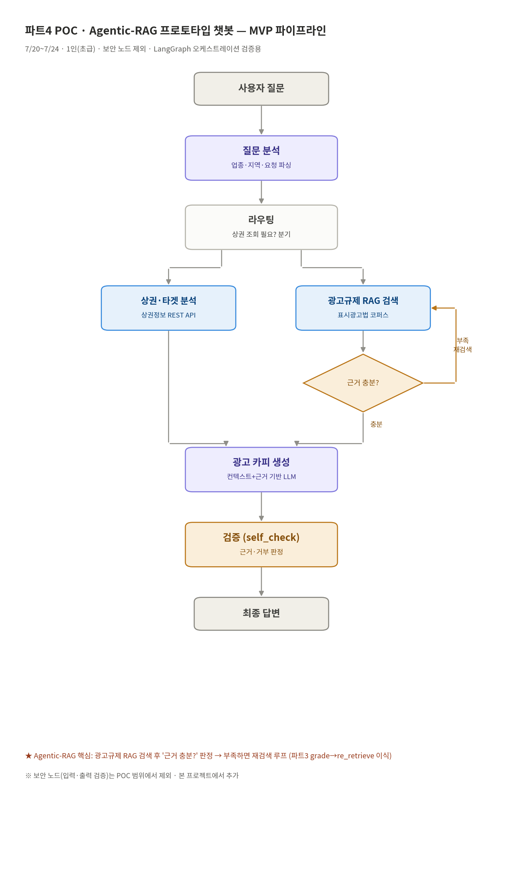

# 파트4 POC · 소상공인 광고 카피 Agentic-RAG 챗봇

파트4 팀 고급 프로젝트(8/4-8/29)에 앞서, **LangGraph로 Agentic-RAG 오케스트레이션이
실제로 동작하는지**를 검증하는 POC입니다. (기간 7/20~7/24 · 1인)

파트3(RFPilot)의 그래프 구조(state → 노드 → 조건부 엣지 → 재검색 루프)를 그대로 이식해,
POC 성공 후 본 프로젝트에서 노드만 추가하면 되도록 설계했습니다.

---

## 파이프라인



```
START → question_analysis → routing ─┬ with_market → market_context ┐
                                     └ copy_only ───────────────────┴→ compliance_rag
compliance_rag →(토글) ┬ agentic_rag → grade
                      └ naive_rag  → copy_generation
grade ─┬ sufficient / out_of_scope / 한도초과 → copy_generation
       └ insufficient(여유)                  → re_retrieve → grade ↺
copy_generation → self_check → END
```

| 노드 | 파일 | 역할 |
| --- | --- | --- |
| question_analysis | `nodes/question_analysis.py` | 지시어 해소 + 업종·지역·요청 슬롯 추출 |
| routing | `nodes/routing.py` | 상권 조회 필요 여부 분기 |
| market_context | `nodes/market_context.py` | 상권정보 REST API 호출(도구 노드) |
| compliance_rag | `nodes/compliance_rag.py` | 광고규제 코퍼스 검색 |
| grade | `nodes/grade.py` | 근거 충분? 판정 (재검색 루프의 판단) |
| re_retrieve | `nodes/re_retrieve.py` | 쿼리를 넓혀 재검색 (루프의 재시도) |
| copy_generation | `nodes/copy_generation.py` | 상권+규제 근거 기반 카피 3안 생성 |
| self_check | `nodes/self_check.py` | 위험 표현 룰 점검 후 경고 삽입 |

---

## 참고 자료

### 소상공인시장진흥공단
- OpenAPI 반경내 상가업소 조회 명세서 — <a href="https://2026-codeit-part4-6team.github.io/codeit-part4-poc-chatbot/reports/소상공인시장진흥공단_상가(상권)정보_storeListInRadius_OpenApi.pdf">바로 가기</a>

- OpenAPI 활용가이드 — [다운로드](https://raw.githubusercontent.com/2026-Codeit-Part4-6Team/codeit-part4-poc-chatbot/main/docs/%EC%86%8C%EC%83%81%EA%B3%B5%EC%9D%B8%EC%8B%9C%EC%9E%A5%EC%A7%84%ED%9D%A5%EA%B3%B5%EB%8B%A8_%EC%83%81%EA%B0%80%28%EC%83%81%EA%B6%8C%29%EC%A0%95%EB%B3%B4_OpenApi%20%ED%99%9C%EC%9A%A9%EA%B0%80%EC%9D%B4%EB%93%9C.hwp)

- 업종분류(2302) 및 연계표 v1 — [다운로드](https://raw.githubusercontent.com/2026-Codeit-Part4-6Team/codeit-part4-poc-chatbot/main/docs/%EC%86%8C%EC%83%81%EA%B3%B5%EC%9D%B8%EC%8B%9C%EC%9E%A5%EC%A7%84%ED%9D%A5%EA%B3%B5%EB%8B%A8_%EC%83%81%EA%B0%80%28%EC%83%81%EA%B6%8C%29%EC%A0%95%EB%B3%B4_%EC%97%85%EC%A2%85%EB%B6%84%EB%A5%98%282302%29_%EB%B0%8F_%EC%97%B0%EA%B3%84%ED%91%9C_v1.xlsx)

- 주요상권현황 — [다운로드](https://raw.githubusercontent.com/2026-Codeit-Part4-6Team/codeit-part4-poc-chatbot/main/docs/%EC%86%8C%EC%83%81%EA%B3%B5%EC%9D%B8%EC%8B%9C%EC%9E%A5%EC%A7%84%ED%9D%A5%EA%B3%B5%EB%8B%A8_%EC%A3%BC%EC%9A%94%EC%83%81%EA%B6%8C%ED%98%84%ED%99%A9_20240101.csv)

---

## 실행 방법

### 1) 설치

```bash
python -m venv .venv && source .venv/bin/activate    # Windows: .venv\Scripts\activate
pip install -r requirements.txt
```

### 2) 환경 변수

`.env.example`을 `.env`로 복사하고 값을 채웁니다. **`.env`는 절대 커밋하지 않습니다.**

```bash
cp .env.example .env
```

| 키 | 필수 | 발급처 |
| --- | :---: | --- |
| `OPENAI_API_KEY` | 필수 | OpenAI |
| `DATA_GO_KR_SERVICE_KEY` | 선택 | 공공데이터포털 상가(상권)정보 API |
| `KAKAO_REST_API_KEY` | 선택 | 카카오 디벨로퍼스(주소→좌표) |

> 상권 키가 없어도 파이프라인은 돌아갑니다. `market_status=skipped`로 기록되고
> 규제 근거만으로 카피를 생성합니다(도구 실패에 강건하도록 설계).

### 3) 인덱스 빌드 (최초 1회)

```bash
python -m backend.retrieval.build_index
```

`data/corpus/*.md`를 청크로 나눠 FAISS 인덱스를 만듭니다.
코퍼스를 수정하면 반드시 다시 실행하세요.

### 4) 실행

```bash
# 터미널 1 — 백엔드 + 프론트 통합
python run.py

# 터미널 2 — 백엔드
python -m backend.main

# 터미널 3 — 프론트
streamlit run frontend/app.py
```

브라우저에서 `http://localhost:8501`로 접속합니다.

### 그래프만 단독 확인

```bash
python -m backend.graph.build     # 노드 흐름 + trace 출력
python -m backend.pipeline        # 진입점 응답 확인
python -m backend.tools.market_api  # 상권 API 단독 점검
```

---

## POC 성공 기준 확인 방법

1. **흐름 완주** — Streamlit에서 질문 후 카피가 나오면 통과
2. **재검색 루프 동작** — 사이드바에서 `agentic_rag` 선택 후, 코퍼스에 없는 업종
   (예: "자동차 정비소 홍보 문구")을 물으면 `재검색 횟수`가 2 이상으로 표시됩니다.
   터미널 로그에 `[재검색] attempt=...` 줄이 찍히는지 함께 확인하세요.
3. **상권 반영** — `상권 정보` 확장 패널에 점포 수·업종 구성이 표시되고,
   카피에 타겟/차별점이 반영됐는지 확인
4. **naive vs agentic 비교** — 사이드바 토글을 바꿔가며 `근거 판정` 지표 차이를 시연

---

## 5일 일정

| 일차 | 작업 |
| --- | --- |
| 7/20(월) | 환경 셋업, state·build 골격, `question_analysis` |
| 7/21(화) | `market_context`(상권 REST·지오코딩), `routing` 조건부 엣지 |
| 7/22(수) | 코퍼스 확충 + 인덱스 빌드, `compliance_rag`·`grade`·`re_retrieve` **재검색 루프** |
| 7/23(목) | `copy_generation`·`self_check`, 엔드투엔드 실행 |
| 7/24(금) | Streamlit 연결, 시나리오 테스트, POC 결과 정리 |

---

## 남은 작업 (POC 진행 중 직접 채울 것)

- **코퍼스 확충**: 현재 `data/corpus/ad_regulations.md`는 시드(약 4청크)입니다.
  표시·광고의 공정화에 관한 법률, 식품 표시·광고법, 공정위 부당광고 심사지침 원문을
  수집해 **10~30청크 이상**으로 늘려야 grade 판정이 의미 있게 동작합니다.
- **상권 API 응답 필드 확인**: `market_api.py`의 `indsMclsNm`(업종중분류) 등 필드명은
  공공데이터포털 "Open API 명세 확인 가이드"에서 실제 응답과 대조해 보정하세요.

---

## 본 프로젝트로 넘길 항목

보안1/2(입력·출력 검증), 경쟁사 리뷰 분석, 자사 후기 인사이트, 업종 벤치마크,
시즌·이슈 타이밍, 이미지 생성·검수, 배리언트 랭킹, 채널별 리포맷, 휴먼 승인(HITL).
모두 `backend/graph/nodes/`에 파일을 추가하고 `build.py`에 엣지만 이으면 됩니다.